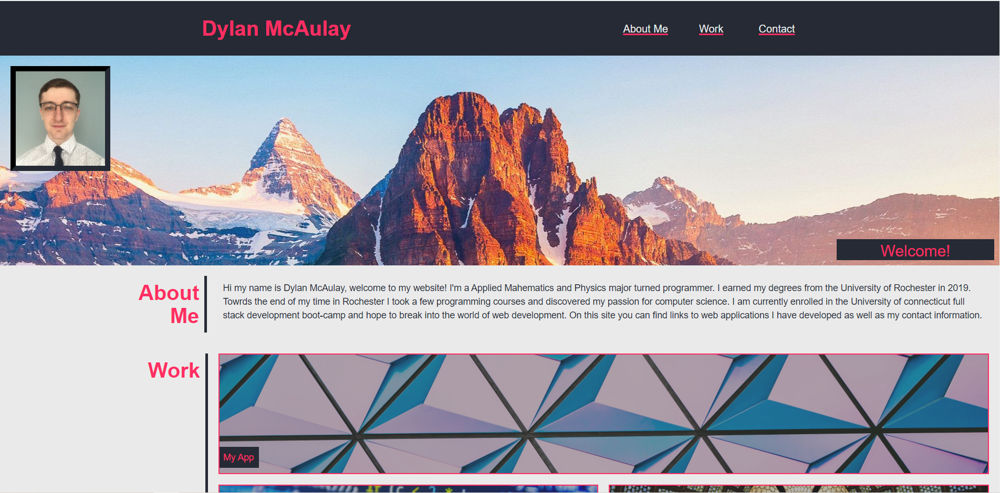

# personal-website
This is a personal site designed to provide a directory to my web applications as well as my contact information. The site itself also acts as a demonstration of my web development skills. The site was clossely modeled off of the example provided in the assignment. I plan to consistently update the site as I aquire new development skills.

# Features

The site features a dynamic design that adapts to all screen sizes. I utalizes flexbox to organize the majority of the page and to smoothly transition between screen widths. Many of the objecs on the site are interactive and will change style when hovered over (e.g. nav links, icture boarder, app images, contact llinks). The page als features a fixed img in the banner which gives the site a mutidimensional feel. 

## Features Still in Progress
Currently I have no web applications to link to, so the My app links all go to a placeholder site. I also want to update the phone and email links to be more useful (i.e. the email link opens the users email with my email in the to section). As mentioned in the discription above, I still want to compleatly customize the look and layout of the site. This is just a starting point.

# Links

Live Website: https://dmcaulay97.github.io/personal-website/  
GitHub Repo: https://github.com/dmcaulay97/personal-website
